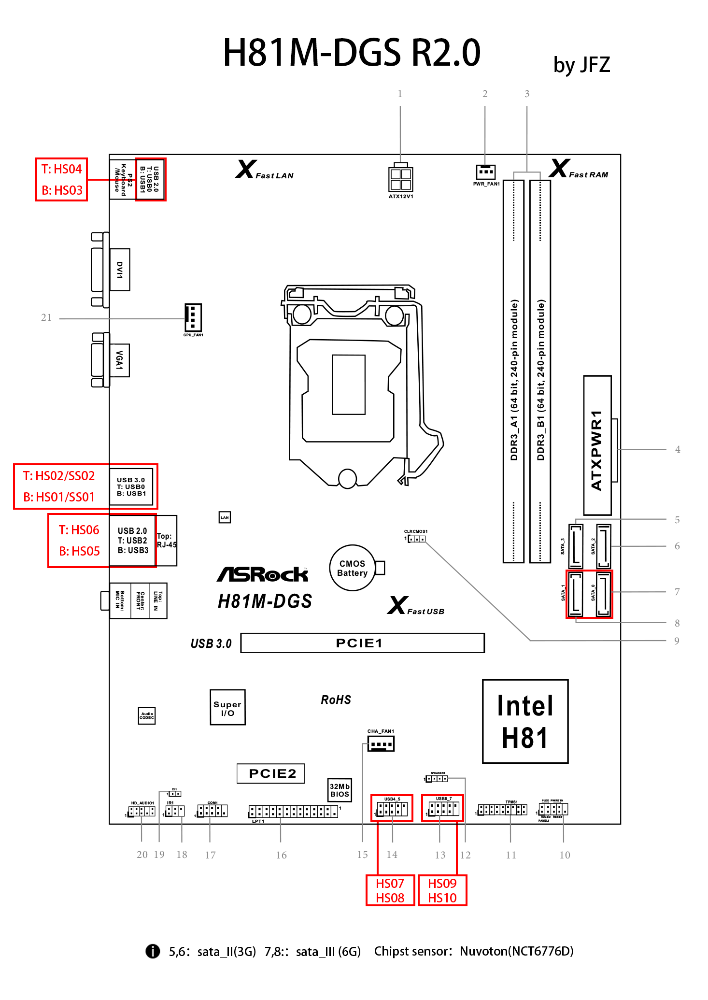

EFI-ASRock-H81M
========

   

English | [中文](README_cn.md)

### Anyway, Everything works fine!!!

***Please download the latest version from [Releases](https://github.com/lichongjia/EFI-ASRock-H81M/releases).***

## Hardware

| Specifications        | Detail                                 |
| :-------------------- | :------------------------------------- |
| Motherboard           | ASRock H81M-DGS R2.0                     |
| Processor             | Intel Core i3-4170 @ 3.70GHz           |
| Memory                | Samsung 4GBx2 DDR3 1600MHz            |
| Hard Disk             | ADATA SP920 Sata SSD 128G        |
| Integrated Video Card | Intel HD Graphics 4400（AAPL,ig-platform-id=0x04120004） |
| External Video Card   | NVIDIA GeForce GT 740                      |
| Sound Card            | Realtek ALC662（layout-id=5）     |
| Network Card          | Realtek RTL8111G                       |

## About

If this project is helpful to you, you can donate or star my WeChat Official Account.

If you have any questions during installation or use, you can send me a message through the contact info on the homepage. Maybe I can give you some help!

